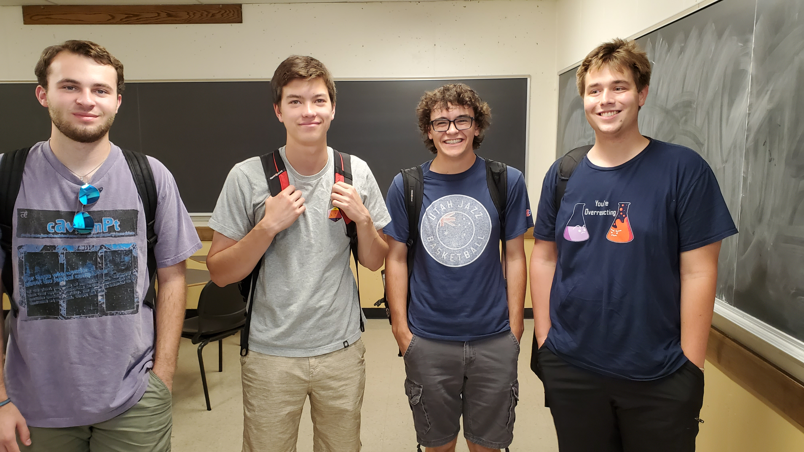

```{r setup, include=FALSE}
knitr::opts_chunk$set(echo = TRUE)
```

# One4All



## Main Goal:
To do something (Filler)

# Braden Griebel


## About Me: 

Hello! I am a Math major and Biochem minor. One question I would like to answer would be what causes seeds to exit a period of dormancy. 


Six months after graduation I hope to be in grad school, I don't know specifically for what, but hopeully something related to statistics. Five years after that I hope to be working on epidemiology for the CDC. During this career I hope my greatest accoplishment is to bring a better understanding of the most effective methods of preventing the spread of malaria. Given this, I hope to learn how to explore data to discover insights about how different variables relate, as well as being able to effectively communicate this to others. 
```{}


                    __
         .,-;-;-,. /'_\
       _/_/_/_|_\_\) /
     '-<_><_><_><_>=/\
       `/_/====/_/-'\_\
        ""     ""    ""

```